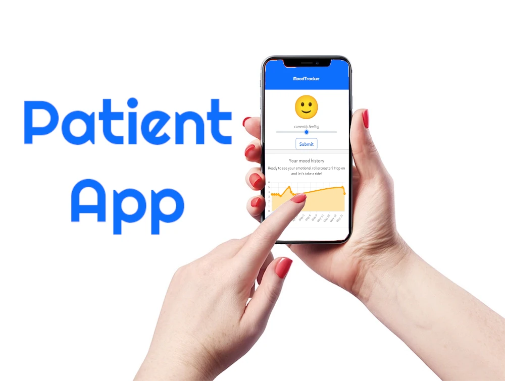

<blockquote style="font-size:large">

The MoodTracker App was developed in response to a doctor's vision of providing ongoing support and follow-ups for patients beyond regular consultation hours. This user-friendly application empowers patients to effortlessly record and track their mood and well-being, while enabling doctors to evaluate treatment effectiveness based on real-time data. With instant visual feedback, patients can easily monitor their progress over time, fostering a deeper understanding of their mental health journey.

</blockquote>

## Key Features:

- Intuitive Mood Recording: MoodTracker offers a simple and intuitive interface that allows patients to conveniently log their emotions and overall well-being on a daily basis. Users can choose from a range of emoticons or provide additional notes to capture their unique experiences accurately.

- Comprehensive Progress Tracking: The app compiles all recorded mood data, generating personalized visual reports that highlight the patient's emotional fluctuations and well-being trends over time. This comprehensive overview facilitates a deeper understanding of progress and helps patients recognize patterns and triggers.

- Collaborative Doctor-Patient Relationship: MoodTracker bridges the gap between patients and doctors by providing a seamless means of communication outside of traditional consultation hours. Doctors can access their patients' recorded mood data, enabling them to monitor progress remotely and evaluate the effectiveness of treatments. This continuous feedback loop promotes a stronger doctor-patient relationship and empowers patients to actively participate in their own well-being.

- Reminders and Notifications: The app includes customizable reminders and notifications to encourage patients to regularly record their mood. These gentle prompts ensure that patients stay engaged with their mental health journey, providing a more accurate reflection of their well-being.

- Privacy and Security: MoodTracker prioritizes the privacy and security of patient data. The app adheres to strict confidentiality standards, ensuring that all information is encrypted and accessible only to authorized individuals, such as the patient's designated healthcare provider.

> MoodTracker revolutionizes mental health care by offering a convenient and accessible solution for both patients and doctors. By facilitating regular mood tracking and empowering patients with visual feedback, the app strengthens the doctor-patient relationship, promotes proactive mental health management, and enhances overall well-being.

<h2 id="content">Overview</h2>

The MoodTracker App was developed in response to a doctor's vision of providing ongoing support and follow-ups for patients beyond regular consultation hours. This user-friendly application empowers patients to effortlessly record and track their mood and well-being, while enabling doctors to evaluate treatment effectiveness based on real-time data. With instant visual feedback, patients can easily monitor their progress over time, fostering a deeper understanding of their mental health journey.

	

		<h3>Intuitive Mood Recording</h3>
		
MoodTracker offers a simple and intuitive interface that allows patients to conveniently log their emotions and overall well-being on a daily basis. Users can choose from a range of emoticons to capture their unique experiences accurately.

	

	

		
	

	<!-- Break -->
	

		<h3>Interdum sapien gravida</h3>
		
Nunc lacinia ante nunc ac lobortis. Interdum adipiscing gravida odio porttitor sem non mi integer non faucibus ornare mi ut ante amet placerat aliquet. Volutpat eu sed ante lacinia sapien lorem accumsan varius montes viverra nibh in adipiscing blandit tempus accumsan.

	

	

		<h3>Faucibus consequat lorem</h3>
		
Nunc lacinia ante nunc ac lobortis. Interdum adipiscing gravida odio porttitor sem non mi integer non faucibus ornare mi ut ante amet placerat aliquet. Volutpat eu sed ante lacinia sapien lorem accumsan varius montes viverra nibh in adipiscing blandit tempus accumsan.

	

	

		<h3>Accumsan montes viverra</h3>
		
Nunc lacinia ante nunc ac lobortis. Interdum adipiscing gravida odio porttitor sem non mi integer non faucibus ornare mi ut ante amet placerat aliquet. Volutpat eu sed ante lacinia sapien lorem accumsan varius montes viverra nibh in adipiscing blandit tempus accumsan.

	

